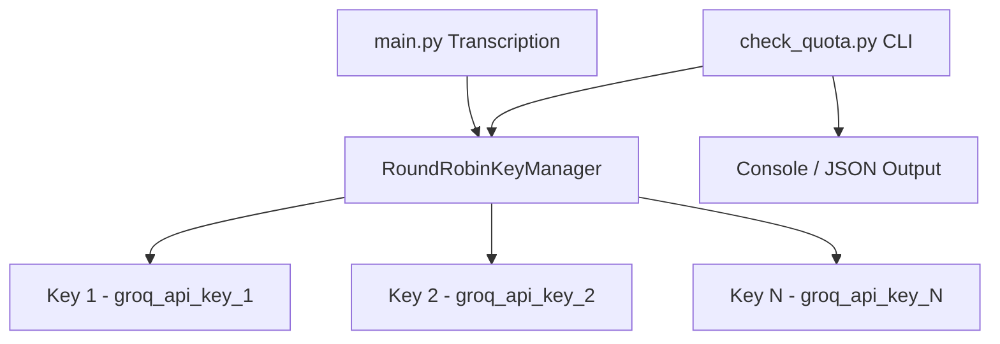

# Groq API Round-Robin & Quota Checker Design

## Overview

This document describes the design for a round-robin API key rotation system and CLI quota checker for Groq API.

## Architecture



## Components

### 1. RoundRobinKeyManager (`groq_key_manager.py`)

A thread-safe key manager that:
- Cycles through multiple API keys in round-robin fashion
- Tracks rate limit headers per key
- Auto-rotates to next key on 429 (rate limit) response
- Stores last-used timestamp per key

#### Class: `RoundRobinKeyManager`

**Constructor:**
```python
def __init__(self, api_keys: List[str], track_rate_limits: bool = True)
```

**Methods:**
- `get_key() -> str` - Get current key (round-robin)
- `report_rate_limit_response(key: str, headers: dict)` - Update rate limit info
- `on_rate_limit(key: str)` - Mark key as rate-limited, move to next
- `get_quota_info() -> dict` - Get quota status for all keys
- `mark_key_exhausted(key: str)` - Mark key as temporarily exhausted
- `reset_key(key: str)` - Reset key state after cooldown

**Rate Limit Headers Tracked:**
- `x-ratelimit-limit-requests` - Requests Per Day (RPD)
- `x-ratelimit-remaining-requests` - Remaining RPD
- `x-ratelimit-limit-tokens` - Tokens Per Minute (TPM)
- `x-ratelimit-remaining-tokens` - Remaining TPM
- `x-ratelimit-reset-requests` - When RPD limit resets
- `x-ratelimit-reset-tokens` - When TPM limit resets

### 2. Quota Checker CLI (`check_quota.py`)

A CLI tool to check remaining quota for all configured API keys.

**Usage:**
```bash
# Check quota for all keys (text output)
python check_quota.py

# Check quota with JSON output
python check_quota.py --json

# List configured keys
python check_quota.py --list-keys
```

**Output (text):**
```
Groq API Quota Status
=====================
Key: gsk_***abc123
  Model: whisper-large-v3
  Requests: 14,370 / 14,400 (daily limit)
  Tokens: N/A (audio model)
  Reset: in 2h 59m 56s

Key: gsk_***def456
  Model: whisper-large-v3
  Requests: 14,400 / 14,400 (daily limit) - FULLY USED
  Tokens: N/A (audio model)
  Reset: in 2h 59m 56s
```

**Output (JSON):**
```json
{
  "keys": [
    {
      "key": "gsk_***abc123",
      "requests_remaining": 14370,
      "requests_limit": 14400,
      "tokens_remaining": null,
      "tokens_limit": null,
      "reset_time": "2026-03-23T03:00:00Z"
    }
  ],
  "checked_at": "2026-03-23T00:23:00Z"
}
```

## .env File Format

### Current Format (single key)
```env
GROQ_API_KEY=gsk_xxx
```

### New Format (multiple keys)
```env
# Single key (backward compatible)
GROQ_API_KEY=gsk_xxx

# OR multiple keys (comma-separated)
GROQ_API_KEYS=<key-1>,<key-2>,<key-3>
```

## Groq Rate Limit Headers

From API responses (applied to all audio/transcription endpoints):

| Header | Description |
|--------|-------------|
| `x-ratelimit-limit-requests` | Requests Per Day (RPD) limit |
| `x-ratelimit-remaining-requests` | Remaining requests for today |
| `x-ratelimit-reset-requests` | Time until RPD limit resets |
| `x-ratelimit-limit-tokens` | Tokens Per Minute (TPM) limit |
| `x-ratelimit-remaining-tokens` | Remaining tokens this minute |
| `x-ratelimit-reset-tokens` | Time until TPM limit resets |

## Files to Create/Modify

1. **Create:** `groq_key_manager.py` - Round-robin key manager
2. **Create:** `check_quota.py` - CLI quota checker
3. **Modify:** `main.py` - Use RoundRobinKeyManager
4. **Modify:** `.env` - Update with multiple key format

## Implementation Notes

1. **Thread Safety:** Use `threading.Lock()` for key rotation
2. **Backoff:** When 429 received, implement exponential backoff before retry with next key
3. **Exhaustion Tracking:** If a key returns 429 repeatedly, mark as "exhausted" until reset time
4. **Quota Check Method:** Make a minimal API call (e.g., chat completions or a transcription) and parse response headers
5. **Backward Compatibility:** If only `GROQ_API_KEY` is set, behave as before (single key mode)
